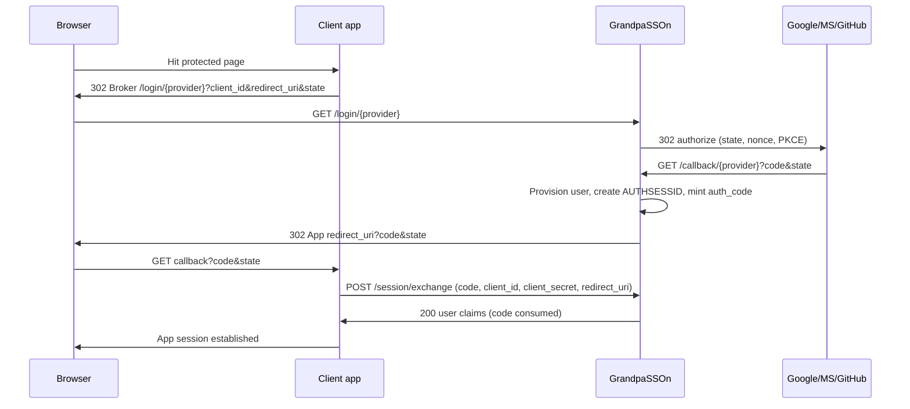

# feat: Close review blockers and start GrandpaSSOn v0 Foundation

## Goal Capsule

- **Objective:** Make the GrandpaSSOn planning docs executable after the doc-review findings, then land Foundation so `docker compose up` serves a working empty broker at `:8080` with schema auto-applied.
- **Authority:** This plan owns the post-review decisions and Foundation slice. After U1 lands, `docs/grandpasson-v0-mvp-plan.md` is the authority for M1–M5. Spec (`docs/grandpasson-spec.md`) remains the product/protocol authority except where U1 explicitly patches it.
- **Stop when:** Origin docs incorporate the Key Technical Decisions below; `docker compose up` boots nginx+php+mysql with the six InnoDB tables; README has Docker quickstart; remaining v0 work is clearly sequenced in the updated MVP plan (not blocked on open architecture forks).
- **Out of this plan:** Full login/callback implementation, provider live E2E, release zip, CI — those stay in the MVP plan after Foundation.

## Product Contract

### Summary

GrandpaSSOn is a minimalist PHP + MySQL SSO broker for shared hosting (see origin). A multi-persona review of the spec and v0 MVP plan found blocking gaps: no closed auth-code redemption path for cross-host clients, session model §7 vs §8 conflict, sequencing bugs, and several security completeness gaps. This plan closes those planning gaps and starts Foundation (M0).

### Problem Frame

Implementers cannot start Foundation safely while the docs disagree on how a client app finishes login after the broker redirect, what the `sessions` table means, and which provider bar v0 actually ships. Mechanical review fixes already landed on main (PR #2). Substantive forks remain.

### Requirements

- R1. Origin docs state one closed broker→client trust path for v0 that works for the cross-host examples in spec §19.
- R2. Session persistence for v0 uses the §8 `sessions` table shape required by `SessionHandlerInterface`; any §7 logical fields are defined relative to that table.
- R3. Provider release bar for v0 is unambiguous (live vs contract-test obligations).
- R4. Provisioning defaults are safe for the stated “internal apps” audience (no silent open door; verified-email rules consistent across providers).
- R5. MVP plan sequencing matches task dependencies (`T-runner` after `T-db`; `T-provision` before `T7`; security checks not deferred past login merge).
- R6. Foundation boots: project bootstrap files, six InnoDB tables, Docker Compose stack on `:8080` / `:8081`.
- R7. Auth codes are single-use, short-lived, bound to a confidential client on redeem, consumed atomically (race-safe), redeemed only with an exact `redirect_uri` match to the stored issuance record, and not stored as reusable plaintext bearer values at rest.
- R8. v0 `/session/exchange` rejects public clients and clients without `client_secret_hash` (confidential-only).

### Actors

- A1. Shared-hosting operator (forks/deploys the zip)
- A2. Internal app developer (registers `oauth_clients`, integrates login)
- A3. End user (signs in via Google / Microsoft / GitHub)

### Key Flows

- F1. Post-review doc reconciliation — A2/agent applies U1 patches so M1+ can proceed without reopening architecture forks.
- F2. Foundation boot — A2/agent runs `docker compose up`; schema applies; front controller responds at `:8080`.

### Acceptance Examples

- AE1. Covers R1, R7, R8. Given patched docs, when a confidential client receives `?code=…&state=…`, then the docs name `POST /session/exchange` that requires `client_id`, `client_secret`, and exact `redirect_uri` match against the stored auth-code row; consumes the code atomically; returns authenticated user claims — not cookie-only `GET /session`. Public or secretless clients are rejected.
- AE2. Covers R6. Given a clean checkout after U2–U4, when `docker compose up` completes, then MySQL has the six §8 tables as InnoDB and HTTP `:8080` returns a non-500 response from the front controller.

### Success Criteria

- No remaining P0 architecture forks in origin docs that block T2/T6/T7.
- `make up` / `docker compose up` works without host PHP/MySQL.
- MVP plan M1+ task list reflects R1/R5/R7 so Flow PR can implement a complete login loop.

### Scope Boundaries

**In scope**

- Patching `docs/grandpasson-spec.md` and `docs/grandpasson-v0-mvp-plan.md` with the KTDs below
- Foundation: T0, T1, T11 (bootstrap, migrations, Docker stack)

**Deferred to follow-up (MVP plan M1–M5)**

- Router, config, DB connection, MySQL sessions (M1)
- Providers and login/callback/provisioning (M2–M3), including implementing `POST /session/exchange`
- Cron, audit, security helpers, build/CI/deploy docs (M4–M5)

**Outside this product’s identity**

- Full OIDC IdP Option B (`/authorize`, JWKS, JWT issuance) in v0
- Admin UI for `oauth_clients`
- Replacing the broker with a per-app drop-in library (product shape stays broker — origin §1)

### Sources

- `docs/grandpasson-spec.md` (v1.2)
- `docs/grandpasson-v0-mvp-plan.md` (after PR #2 safe-auto fixes)
- Doc-review session findings (coherence, feasibility, security-lens, scope-guardian, product-lens, adversarial)
- RFC 9700 / OAuth 2.1 guidance: confidential clients authenticate at code redemption; PKCE recommended even for confidential clients; bind codes to the client

## Planning Contract

### Assumptions

These are planner defaults for previously open review decisions (not user session-settled). Override before U1 if undesired.

1. **Trust path:** v0 uses short-lived broker auth codes redeemed via **`POST /session/exchange`** by confidential clients only (`client_id` + `client_secret` vs `client_secret_hash`; reject `type=public` and missing `client_secret_hash`). Redemption MUST include exact `redirect_uri` match to the issued auth-code record and MUST consume the code in one transactional update (`consumed=0` AND unexpired in the write predicate). Host-only `AUTHSESSID`; no parent-domain cookie SSO in v0. `GET /session` remains cookie-authenticated introspection for the broker’s own browser session / same-site demos only.
2. **Sessions:** Spec §8 `sessions` table is authoritative for `SessionHandlerInterface`. Spec §7 logical fields (`client_id`, `ip_hash`, `amr`, …) live inside the `data` MEDIUMBLOB (or are derived at write time), not as competing columns. Spec §7 YAML is reframed as logical session metadata, not DDL.
3. **Providers:** Keep all three provider implementations in v0. **DoD:** Google live E2E required; Microsoft and GitHub must pass unit/contract tests (live creds optional in CI) — affirm and clarify the existing MVP DoD as intentional, not accidental soft-scope.
4. **Access gate:** Add `ALLOWED_EMAIL_DOMAINS` (comma-separated). Empty list in production refuses auto-create; `APP_ENV=dev` may allow open auto-create for local demos. Auto-link still requires verified email.
5. **Microsoft:** Prefer single-tenant discovery via `MS_TENANT_ID` (default); `/common` only when explicitly configured. Never treat raw UPN as verified email for auto-link — require verified `email` claim (or documented Graph-verified equivalent).
6. **Auth codes at rest:** Store only a hash of the code (lookup by hash); return raw code once in the redirect query.
7. **Client CSRF:** Persist client-supplied `state` separately from provider OAuth `state`; echo client `state` with `code` on redirect to the client.
8. **Sequencing:** Move `T-runner` after `T-db` into M1; fold state/PKCE/exact redirect/`return_to`/disabled-user/disabled-client into T6/T7 acceptance; narrow `T-security` to throttle + shared helpers + secret handling.
9. **Migrator:** Prefer CLI/`cron/migrate.php` via cPanel cron; if HTTP entrypoint exists, require one-time `MIGRATE_TOKEN` and fail closed when unset.

### Key Technical Decisions

- KTD1. Add minimal confidential-client code redemption (`POST /session/exchange`) to v0 public endpoints instead of deferring all of `/token`. Chosen over parent-domain cookies (fragile SameSite/shared-hosting) and over same-host-only v0 (contradicts §19 examples). Aligns with RFC 9700 binding of authorization codes to confidential clients.
- KTD2. §8 DDL wins for sessions; §7 is logical metadata in `data`. Chosen over widening the SQL to mirror §7 (would fight PHP session handler blob semantics).
- KTD3. Google-live + MS/GitHub contract tests for v0 ship bar. Chosen over cutting MS/GitHub from v0 (loses interface proof) and over requiring three live IdPs (raises adoption friction before first zip).
- KTD4. Domain allowlist env for provisioning. Chosen over open auto-create (unsafe for “internal apps”) and over invite-only admin UI (deferred).

### Product Contract preservation

Product Contract unchanged in intent (broker, three providers, session-only Option A spirit, shared-hosting constraints). U1 changes protocol/ops detail: adds `POST /session/exchange`, clarifies session DDL vs logical model, and adds allowlist — required so Option A + auth codes is a closed loop.

### High-Level Technical Design

### Risks

| Risk | Mitigation |
|---|---|
| Assumptions rejected by stakeholder after U1 | Keep U1 as a docs-only PR; easy to revise before code depends on exchange |
| `/session/exchange` scope-creeps into full OIDC `/token` | Document grant type as broker auth-code only; no refresh, no JWT in v0 |
| Allowlist empty in prod locks everyone out | Fail-fast config error listing the missing/empty var; `.env.example` documents required domains for non-dev |
| Dual migration SQL trees drift | Single source under `app/Infrastructure/Db/Migrations/`; Docker init copies or CI diffs |

### Implementation constraints

- No Redis/queues/daemons; MySQL only; cron for cleanup
- Composer resolved in Docker; `vendor/` bundled for shared hosting
- Repo today is docs-only greenfield — no local PHP patterns to mirror yet; follow spec §9 folder layout

### Sequencing

`U1 → U2 → U3 → U4`. After U4, continue with updated MVP plan M1 (`T-config` → `T-db` → `T-runner` → `T-router` → `T2` …).

## Implementation Units

### U1. Reconcile origin docs with review KTDs

- **Goal:** Spec and MVP plan no longer block implementers on P0 forks from the doc review.
- **Requirements:** R1–R5, R7
- **Dependencies:** none
- **Files:** `docs/grandpasson-spec.md`, `docs/grandpasson-v0-mvp-plan.md`, `docs/plans/2026-07-21-001-feat-post-review-v0-next-steps-plan.md` (link from README if useful)
- **Approach:**
  - Spec §2/§10/§17: add `POST /session/exchange` to public endpoints; document confidential-client redemption; clarify Option A = auth-code + exchange (not cookie Domain SSO).
  - Spec §7 vs §8: reframe §7 as logical session metadata stored in `data`; keep §8 DDL.
  - Spec §8 `auth_codes`: note hashed-at-rest storage; optional column rename guidance (`code_hash`).
  - Spec §12 / config: `ALLOWED_EMAIL_DOMAINS`; remove `primary_email` from `sync_fields`.
  - Spec §4 / Microsoft: `MS_TENANT_ID` default; verified email required for link.
  - MVP plan: add dedicated task **`T-exchange`** (files: `app/Http/Controllers/SessionExchangeController.php`; deps: T7, T-db; acceptance: confidential-only, exact `redirect_uri`, atomic consume, audit failures); place it in M3 after T7; move `T-runner` after `T-db`; fold security checks into T6/T7; document failure matrix; echo client `state`; hash auth codes; disabled client rejection (already partially applied).
- **Test scenarios:** none — documentation only.
- **Verification:** A reader can answer “how does the client finish login?” and “what columns does `sessions` have?” from the docs without contradiction.

### U2. Project bootstrap (T0)

- **Goal:** Named MIT project with Composer deps declared and env template complete.
- **Requirements:** R6
- **Dependencies:** U1 (so `.env.example` includes new vars: exchange-related none, `ALLOWED_EMAIL_DOMAINS`, `MS_TENANT_ID`)
- **Files:** `README.md`, `composer.json`, `.env.example`, `.gitignore` (`LICENSE` exists)
- **Approach:** Declare packages from spec §16; document Docker quickstart; gitignore `.env`, `/dist`, release zip; do **not** gitignore `/vendor` policy note (bundled later).
- **Execution note:** This is packaging/docs; prefer smoke (`composer validate`) over unit tests.
- **Test scenarios:**
  - Happy path: `composer.json` lists `league/oauth2-client`, `league/oauth2-google`, `league/oauth2-github`, `firebase/php-jwt`.
  - Edge: `.env.example` includes every var referenced by the patched config contract (`ALLOWED_EMAIL_DOMAINS`, `MS_TENANT_ID`, DB, provider secrets, `MIGRATE_TOKEN`).
- **Verification:** README tagline + `docker compose up` quickstart present; `composer validate` succeeds when Composer is available (host or one-shot container).

### U3. Schema migrations (T1)

- **Goal:** Six InnoDB tables matching patched spec §8 (including auth_code hash guidance).
- **Requirements:** R2, R6, R7
- **Dependencies:** U1
- **Files:** `app/Infrastructure/Db/Migrations/001_create_users.sql` … `006_create_audit_events.sql`, `docker/mysql/init/*.sql` (identical copies), `tests/Schema/MigrationFilesTest.php` (or equivalent assert both trees match)
- **Approach:** Single source of truth; Docker init directory mirrors app migrations. Implement `auth_codes` with `code_hash` (or document hash-in-`code` column clearly in migration comments).
- **Execution note:** Start with a test that both migration directories are byte-identical / checksum-equal.
- **Test scenarios:**
  - Happy path: all six files exist; each ends with `ENGINE=InnoDB`.
  - Integration: directory checksum/diff between `app/.../Migrations` and `docker/mysql/init` is empty.
  - Edge: `auth_codes` definition includes hash-at-rest comment or `code_hash` column per U1.
- **Verification:** Opening the SQL shows tables from patched §8; dual trees do not drift.

### U4. Docker dev stack (T11)

- **Goal:** One-command local broker environment.
- **Requirements:** R6
- **Dependencies:** U2, U3
- **Files:** `docker-compose.yml`, `docker/nginx/{Dockerfile,default.conf}`, `docker/php/{Dockerfile,php.ini}`, `docker/mysql/init/*`, `public_html/index.php` (minimal stub), `public_html/.htaccess` or nginx rewrite equivalent, `Makefile` (`up`/`down` targets at minimum)
- **Approach:** Match spec §18.2 as closely as practical for the nginx/php/mysql Foundation slice; PHP extensions `pdo_mysql`, `curl`, `openssl`, `json`. Stub front controller returns 200 with plain text or JSON `ok`. Defer cron-service wiring to the updated MVP plan’s T9 follow-up so Foundation stays limited to one-command web+db boot.
- **Execution note:** Prefer runtime smoke (`docker compose up` + curl `:8080`) over unit coverage.
- **Test scenarios:**
  - Happy path: `docker compose up -d` then HTTP GET `http://localhost:8080` returns success.
  - Integration: MySQL shows six tables after first boot.
  - Error: missing `.env` — container fails with a clear message or documented copy-from-example step in README.
- **Verification:** AE2 holds on a clean machine with only Docker installed.

## Verification Contract

- Docs: manual contradiction check for R1/R2 after U1 (or re-run headless doc review on the two origin files).
- Bootstrap: `composer validate` (when tooling available).
- Migrations: automated identical-tree check in `tests/` once PHPUnit exists (U3 may ship a minimal phpunit config or a shell checksum in Makefile until then).
- Docker: `docker compose up -d` && `curl -sf http://localhost:8080` && mysql client/query showing table count ≥ 6.
- Do not claim full MVP DoD (Google live E2E, release zip) under this plan.

## Definition of Done

- [ ] U1 merged: KTDs visible in spec + MVP plan; no remaining “auth code with no redeem” or “§7 vs §8” contradiction.
- [ ] U2–U4 merged: Foundation boot works per AE2.
- [ ] README points operators/agents to `docs/grandpasson-v0-mvp-plan.md` for M1+ and to this plan for why exchange/allowlist exist.
- [ ] Open questions below are either resolved or explicitly deferred (non-blocking).

## Outstanding Questions

**Blocking:** none remaining for Foundation — defaults recorded under Assumptions.

**Deferred (non-blocking)**

- Exact JSON claim shape of `POST /session/exchange` response (id, email, display_name, status minimum — finalize in M3).
- Whether public clients (PKCE-only, no secret) are supported after v0.
- Retention/purge policy for `audit_events` and `raw_claims_json`.
- When Option B (full IdP) becomes a supported promise.

## Appendix

### Suggested PR slices

1. **Docs PR** — U1 only.
2. **Foundation PR** — U2 + U3 + U4.

### Relationship to MVP plan

After this plan’s DoD, execute `docs/grandpasson-v0-mvp-plan.md` from M1 onward (with U1’s sequencing and `T-exchange` updates). Do not re-litigate KTD1–KTD4 during M1–M5 unless invalidating evidence appears.
